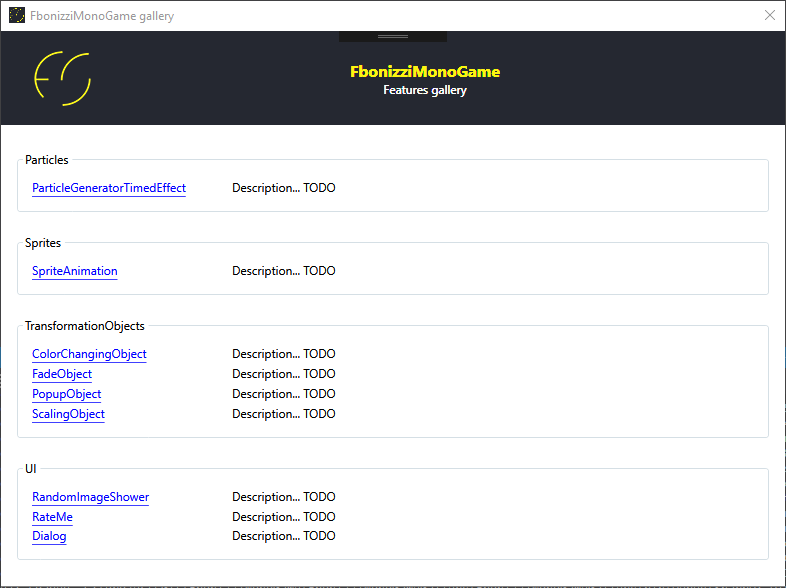

#  FbonizziMonoGame

These are some libraries that I built over `MonoGame` Framework to make my games. You can find them on `Windows Store` and `Android Play Store` by searching for **Francesco Bonizzi**. 

All my games are **totally free** and **open source**, you can find them in my other repositories. Actually, my games are:
- TODO
- TODO
- ...

---

### What these libraries can do

Work in progress / talk about the gallery solution with some image

##### FbonizziMonoGame
FbonizziMonoGame is a simple set of libraries I made to code my games (they'r in my repos too). This library has some abstractions that are implemented in my platform specific libraries.

It contains, in particular:
- A `Sprite` abstraction with a `SpriteAnimation` class in order to make animations from a spritesheet
- A `SplashScreenLoader` abstraction in order to manage the loading of all assets while showing a splashscreen.
- A `Camera2D` to show game worlds that are larger than the screen size
- A `DynamicScalingMatrixProvider` that manages screen resizing and scaling for different resolutions
- Some useful extensions to many XNA's classes
- Input abstractions (interely copied from [craftworkgames MonoGame.Extended](https://github.com/craftworkgames/MonoGame.Extended))
- A particle generator to render some effects (you can see it at work in the `FbonizziMonoGameGallery` project)
- Some `TransformationObjects`(s) with little logic to change color over time, fade in/out, popup, change scale over time on drawable objects
- A full MonoGame `RateMe` abstraction (implemented for every platform)
- Some UI implementation (they are very very drafty) to show some dialog and some buttons
- `PlatformAbstractions`: they are simple interfaces to make this library compatible with `UWP`, `Windows Desktop`, `Android`, and potentially every .NET compiling project:
  - `ISettingsRepository`: abstracts "write data" / "read data" to each platform storage
  - `ITextFileLoader`: abstracts "read a text file" on the platform storage
  - `IFbonizziGame`: abstracts some basic game logic of my games: pause, resume
  - `IWebPageOpener`: nothing to explain :-)

##### FbonizziMonoGame.UWP
It's the Windows Universal implementation of `FbonizziMonoGame`

##### FbonizziMonoGame.WindowsDesktop
It's the Windows Desktop implementation of `FbonizziMonoGame`

##### FbonizziMonoGame.Android
It's the Xamarin/Android implementation of `FbonizziMonoGame`

---

### Getting started
The first thing you could do is to download one of my games to see what these libraries can do. Secondly you could just install one of them via `Nuget` and play a little with it :-)

### FbonizziMonoGameGallery

I started a little WPF application (thanks to MarcStan/MonoGame.Framework.WpfInterop for the library) with some examples of what the library can do:

---

### How to contribute

- Report any issues
- Propose new features / improvements
- Asking for a pull request on dev branch
- Playing my games ;-)
- Just telling your opinion

---

## Infrastructure status

### Build

| Name | Status |
| ---- | ------ |
| All repository build |  |

### Nuget

| Package | Version |
| ------- | ------- |
| FbonizziMonoGame |  |
| FbonizziMonoGame.UWP |  |
| FbonizziMonoGame.WindowsDesktop |  |
| FbonizziMonoGame.Android |  |

